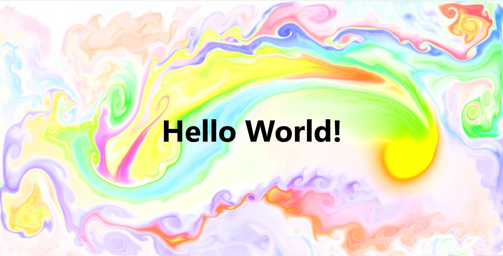

# WebGL Fluid Background

<p align="left">
    
    
    
    
</p>

A WebGL-based fluid simulation adapted from PavelDoGreat’s project, optimised for creating dynamic website backgrounds.

## Usage

### 1. Setup

Start by getting the project files onto your local machine.

* **Clone the Repository:**
    ```bash
    git clone https://github.com/yourusername/WebGL-Fluid-Background.git
    ```
* **Or Download:** Download the project as a ZIP file and extract it.

### 2. File Structure

Ensure all necessary files are in your project directory:
* `index.html`
* `fluid-overlay-styles.css`
* `webgl-fluid.js` (The core simulation logic)
* `config.json` (For simulation settings)
* `LDR_LLL1_0.png`

### 3. HTML Integration

The `index.html` file is intended to serve as the main page of the website you are developing. 
The simulation automatically renders on the full-viewport **`<canvas>`** element. To display content over the fluid background, position it with a **higher `z-index`** than the canvas.

* **Overlay Content:** Elements like the provided `.overlay-heading` are styled in `fluid-overlay-styles.css` to sit visually on top of the animation (using `z-index: 1`).
* **Scrollable Content:** For content that extends below the animated area, add it **after** the `<canvas>` element in `index.html`. The canvas is fixed to a height of `100vh`, and the remaining page content will flow naturally underneath it, allowing the user to scroll.

### 4. Running the Simulation

Open **`index.html`** in your web browser. The fluid simulation should start immediately and will respond to your mouse or touch movements.

> ⚠️ **Note:** This project **requires a WebGL-compatible browser**. If the background does not appear, ensure WebGL is enabled in your browser settings.

## Configuration

The behaviour of the fluid simulation can be customised via the config.json file. Adjust the parameters to change resolution, physics, colours, and more. 
You can use [Pavel's website](https://paveldogreat.github.io/WebGL-Fluid-Simulation/) to adjust the parameters visually, then copy those settings to the .json file. 

## Credits

This project is a fork of [WebGL Fluid Simulation](https://github.com/PavelDoGreat/WebGL-Fluid-Simulation) by Pavel Dobryakov.

Modifications made by [Thomas Kabalin](https://github.com/tkabalin).

## License

The code is available under the [MIT license](LICENSE)

## Support & Share

If you find this project useful, please consider **starring the repository**.  

If you use this project in your own work, I would love to **see what you build**! Please **share your project** or **fork the repo**.  